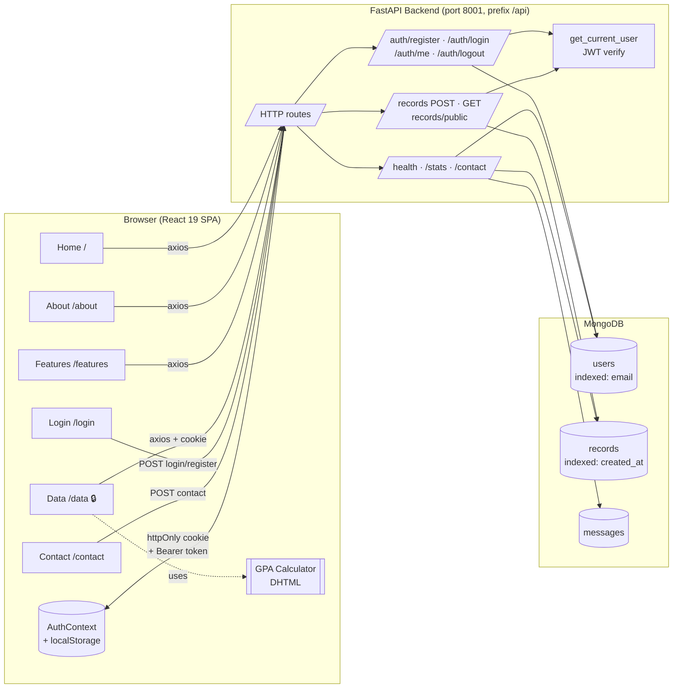
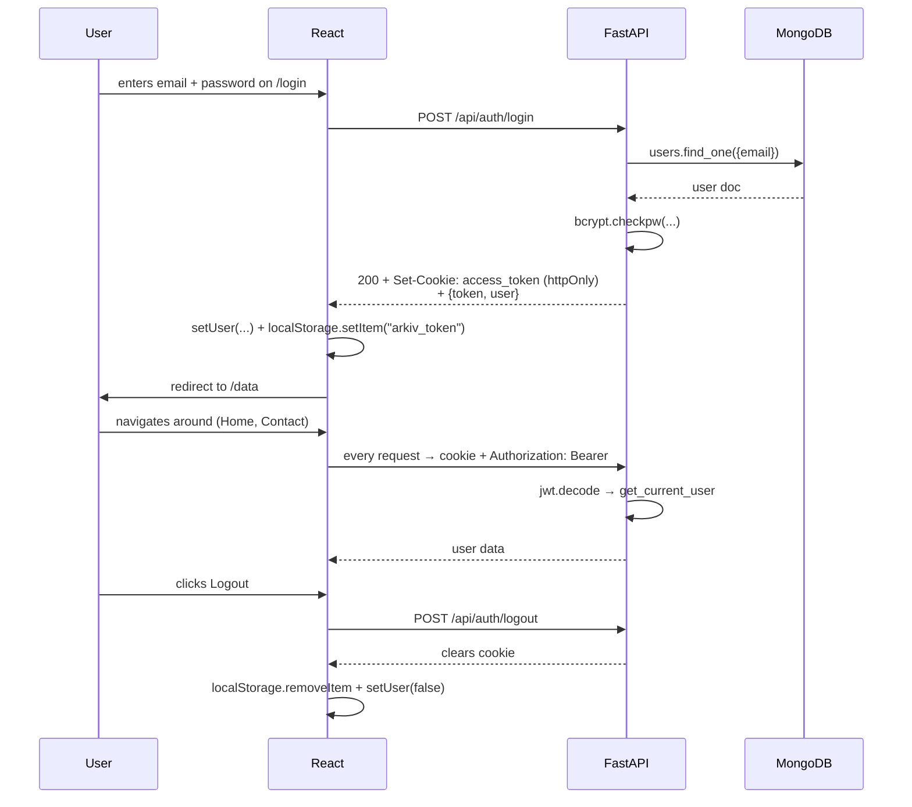

# ARKIV — System Architecture

## High-level diagram

## Page → endpoint matrix

| Page         | Public? | Reads                              | Writes                          |
| ------------ | ------- | ---------------------------------- | ------------------------------- |
| Home `/`     | ✅       | `GET /api/stats`, `GET /api/records/public` | —                          |
| About        | ✅       | —                                  | —                               |
| Features     | ✅       | —                                  | —                               |
| Login        | ✅       | —                                  | `POST /api/auth/login` or `/register` |
| Data 🔒      | Auth    | `GET /api/auth/me`, `GET /api/records`, `GET /api/stats` | `POST /api/records`     |
| Contact      | ✅       | —                                  | `POST /api/contact`             |
| (Navbar)     | both    | `GET /api/auth/me` (on mount)      | `POST /api/auth/logout`         |

## Authentication flow

## Tech choices

| Layer    | Choice                       | Why                                              |
| -------- | ---------------------------- | ------------------------------------------------ |
| UI       | React 19 + Tailwind          | Component model + utility-first responsive CSS    |
| Routing  | React Router 7               | SPA navigation matching the 6-page brief         |
| Auth     | JWT (HS256) in httpOnly cookie | Cross-page session, XSS-resistant                |
| Backend  | FastAPI + Pydantic           | Server-side validation + auto OpenAPI docs       |
| DB       | MongoDB (motor async driver) | Document model fits flexible academic records    |
| Hashing  | bcrypt                       | Industry-standard password hashing               |
| Icons    | Phosphor                     | Sharp, technical line-icons (no emoji)           |
| Fonts    | Cabinet Grotesk + IBM Plex   | Editorial / Swiss aesthetic, not generic Inter   |
